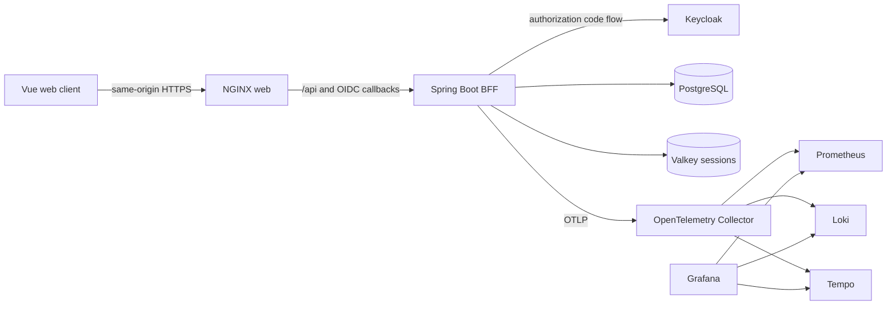

# Architecture

BGStore begins as a modular monolith because table allocation, reservations, play sessions, pricing, and payment records share transactional invariants. The modules may later be extracted behind their existing boundaries when scale or ownership—not speculation—justifies it.

The browser never holds access or refresh tokens. NGINX serves the single-page application and proxies same-origin requests to the BFF. Spring Security owns login, callback, session, CSRF, and logout behavior. API endpoints default to authenticated.

## Repository boundaries

| Path                  | Authority                                                                 |
| --------------------- | ------------------------------------------------------------------------- |
| `apps/web`            | Browser UI and generated contract consumer                                |
| `apps/api`            | Domain modules, adapters, security, and generated contract implementation |
| `packages/contracts`  | Versioned HTTP contract                                                   |
| `deploy/charts`       | Application Kubernetes resources                                          |
| `deploy/argocd`       | Desired applications and shared platform services                         |
| `infra/local`         | Reproducible development dependencies                                     |
| `infra/observability` | Local telemetry pipeline configuration                                    |

Nx coordinates the repository graph and cross-language tasks. It does not replace Gradle, Vite, Vitest, Playwright, or Helm; each ecosystem retains its native, inspectable build.

## Quality seams

- Contract validation and deterministic client/server generation
- Pure controller/domain tests without infrastructure
- Testcontainers integration tests against real PostgreSQL and Valkey-compatible Redis
- Spring Modulith structure verification
- Vue component tests against generated API types
- Playwright UI smoke tests and a full browser–Keycloak–API–database test
- Container health, Compose rendering, and Helm rendering

## Scaling path

Scale stateless web and API replicas independently. Shared sessions prevent pod affinity requirements. CloudNativePG provides PostgreSQL HA in the reference deployment. Prefer a managed PostgreSQL or Valkey service when a target cloud makes it operationally cheaper. Extract a module only after measuring load, deployment cadence, failure isolation, or team ownership pressure.
